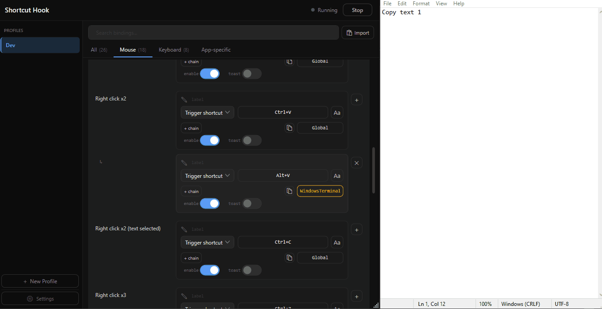
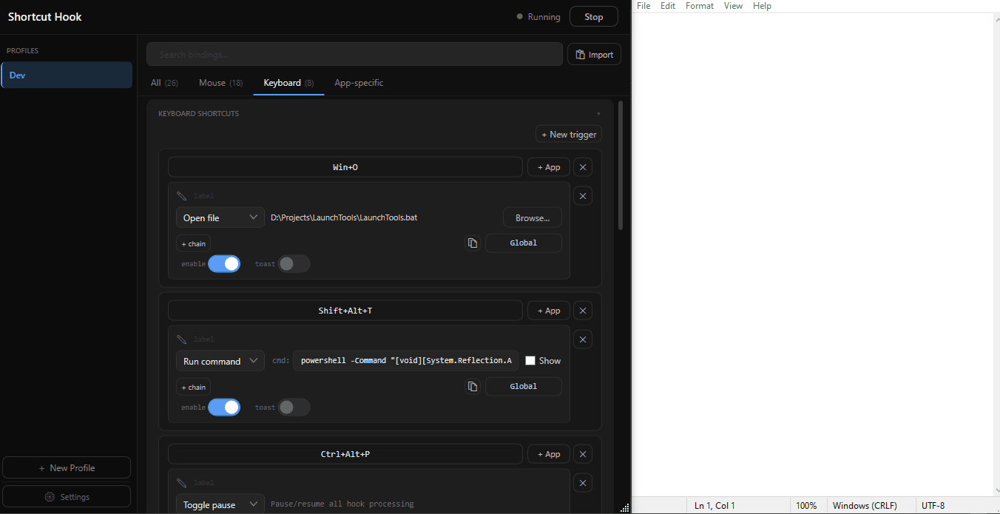
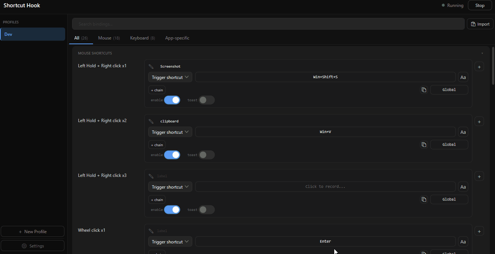

<p align="center">
  
</p>

<h1 align="center">ShortcutHook</h1>

<p align="center">
  <strong>A modern, offline-first Windows utility to map mouse gestures and keyboard combos to shortcuts, files, and commands.</strong>
</p>

<p align="center">
  <a href="https://github.com/veera-bharath/ShortcutHook/releases"></a>
  <a href="https://github.com/veera-bharath/ShortcutHook/blob/main/LICENSE"></a>
  
</p>

---

ShortcutHook maps mouse gestures and keyboard chords to custom actions, shell commands, or text expansions. It runs as a lightweight background daemon coupled with a modern WPF settings user interface.

## 🚀 Key Features

* 🖱️ **Advanced Mouse Gestures** — Map custom mouse clicks, double clicks, held-clicks, or modifier-scrolling (e.g. Shift/Ctrl/Alt+Scroll) to complex actions.
* ⌨️ **Keyboard Chords & Text Expansion** — Map multi-key combos (like `Ctrl+S+L`) or trigger instant snippet typing (`type:`) via clipboard-safe automation.
* 🎯 **Context-Aware Scoping** — Bindings can target specific foreground applications or trigger on process launch, exit, focus, or blur events.
* 📋 **Selection-Aware Triggers** — Advanced double-right-click actions that dynamically handle selected text/files vs unselected paste states natively.
* 📂 **Multi-Profile Management** — Group your hotkeys into profiles (e.g. Default, Coding, Gaming) and switch active layouts instantly.
* ⚡ **Offline & Lightweight** — Built entirely in pure C# (.NET 8) with native Win32 hooks. Zero cloud dependencies, zero tracking, self-contained single `.exe`.

---

## 📺 Preview

### 🖱️ Mouse Gestures
Map custom mouse clicks, double clicks, held-clicks, or modifier-scrolling (e.g., Alt+Wheel for horizontal scroll).


### ⌨️ Keyboard Actions
Create powerful multi-key chords and text expansions. Smart defer logic automatically handles prefix shortcuts without key conflicts.


### 📂 Profiles & Context Switching
Organize hotkeys into profiles (e.g., Default, Coding, Gaming) and switch between them instantly.


---

## ⬇️ Download & Getting Started

Grab the latest **ShortcutHookUI.exe** directly or browse all available versions:

* 🚀 **[Download v2.0.0 EXE](https://github.com/veera-bharath/ShortcutHook/releases/download/v2.0.0/ShortcutHookUI-2.0.0.exe)**
* 📦 **[Browse Releases](https://github.com/veera-bharath/ShortcutHook/releases)**

### Quick Setup:
1. Run `ShortcutHookUI.exe`.
2. The setup wizard appears on first launch — choose an app folder (default `C:\Tools\ShortcutHook`) and click **Finish Setup**.
3. Configure your shortcuts — a **Save Changes** bar slides up at the bottom when you have unsaved edits.
4. The daemon starts automatically whenever you save.

> [!NOTE]
> **SmartScreen / Antivirus warnings**: The exe is currently unsigned. Windows SmartScreen may show "Windows protected your PC" on first launch — click **More info → Run anyway**. Your antivirus may also flag the background daemon, since it installs low-level keyboard/mouse hooks (a pattern shared with keyloggers, but used here only to detect your configured shortcuts). The source is fully open — review it or build from source yourself to verify.

---

<details>
<summary>🛠️ Advanced Configuration & JSON Schema</summary>

### Install Layout
| What | Where |
|------|-------|
| App (UI exe) | Your chosen folder (default `C:\Tools\ShortcutHook`) |
| Daemon exe | Always `C:\Tools\ShortcutHook\ShortcutHookDaemon.exe` |
| Config | `C:\Tools\ShortcutHook\shortcuts.json` |

### Config Schema
```json
{
  "altHScroll": false,
  "activeProfile": "Default",
  "ignoredApps": ["YourGame.exe", "mstsc.exe"],
  "profiles": [
    {
      "name": "Default",
      "bindings": [
        { "trigger": "mouse:left+right",        "outputs": ["Win+Shift+S"] },
        { "trigger": "mouse:left+rightx2",      "outputs": ["Ctrl+Z"] },
        { "trigger": "mouse:double-right",      "outputs": ["Ctrl+V"] },
        { "trigger": "mouse:double-right-sel",  "outputs": ["Ctrl+C"] },
        { "trigger": "mouse:right-scroll-down", "outputs": ["Delete"] },
        { "trigger": "mouse:alt-scroll-up",     "outputs": ["hscroll:left"] },
        { "trigger": "mouse:alt-scroll-down",   "outputs": ["hscroll:right"] },
        { "trigger": "mouse:shift-scroll-up",   "outputs": ["Left"],  "debounce": true },
        { "trigger": "mouse:double-wheel",      "outputs": ["open:C:\\path\\to\\app.lnk"] },
        { "trigger": "key:Ctrl+Alt+C",          "outputs": ["Ctrl+C"] },
        { "trigger": "key:Ctrl+S+L",            "outputs": ["F12"],   "apps": ["Code.exe"] },
        { "trigger": "key:Ctrl+Alt+T",          "outputs": ["open:C:\\path\\to\\app.lnk", "Win+Shift+S"], "outputDelay": 300 },
        { "trigger": "key:Ctrl+Alt+E",          "outputs": ["type:user@example.com"], "showToast": true },
        { "trigger": "key:Ctrl+Alt+P",          "outputs": ["toggle:pause"], "showToast": true },
        { "trigger": "key:Ctrl+Alt+L",          "outputs": ["cmdw:tasklist"], "enabled": false, "label": "list running processes" },
        { "trigger": "key:Ctrl+Alt+1",          "outputs": ["profile:Gaming"], "showToast": true },
        { "trigger": "launch:chrome.exe",       "outputs": ["profile:Browser"] },
        { "trigger": "exit:chrome.exe",         "outputs": ["profile:Default"] }
      ]
    }
  ]
}
```

> [!NOTE]
> Older configs that used a top-level `"bindings"` array (no `profiles`) are automatically migrated on load into a `"Default"` profile.

### Trigger Prefixes
* `mouse:` — `left+right`, `left+rightx2`, `left+rightx3`, `double-right`, `double-right-sel`, `triple-right`, `single-wheel`, `double-wheel`, `triple-wheel`, `right-scroll-down`, `right-scroll-up`, `shift-scroll-down`, `shift-scroll-up`, `ctrl-shift-scroll-down`, `ctrl-shift-scroll-up`, `alt-scroll-down`, `alt-scroll-up`
* `key:` — any `Mod+Key` combo. Modifiers: `Ctrl`, `Shift`, `Alt`, `Win`
* `launch:<processName>` / `exit:<processName>` — fires when the named process starts or exits (e.g. `launch:chrome.exe`).
* `app-focus:<processName>` / `app-blur:<processName>` — fires when the named process gains or loses foreground focus.

> [!IMPORTANT]
> To prevent hijacking standard operating system and application shortcuts, global single-letter `Ctrl` triggers (e.g. `Ctrl+A` through `Ctrl+Z`) are restricted and blocked.

### Top-Level Fields
* `altHScroll` — when `true`, holding Alt while scrolling fires a horizontal scroll instead of vertical.
* `activeProfile` — name of the profile whose bindings the daemon loads.
* `ignoredApps` — array of process names where all ShortcutHook triggers are suppressed.
* `profiles` — array of named binding sets.

### Per-Binding Optional Fields
* `outputs` — array of one or more actions executed in order (chained).
* `outputDelay` — milliseconds to wait between chained `outputs` steps.
* `label` — short user note describing the binding. UI-only.
* `apps` — array of process names to scope the binding to specific foreground apps.
* `enabled` — set to `false` to disable a binding without deleting it.
* `debounce` — set to `true` on scroll gesture bindings to ignore repeated firings within 200 ms.
* `showToast` — set to `true` to show a brief on-screen toast notification when this binding fires.

### Outputs Syntax
* Keyboard chord — `Mod+Key` syntax (e.g. `Win+Shift+S`)
* Shell execute — `open:<path>` to launch an app, file, or folder
* Horizontal scroll — `hscroll:left` or `hscroll:right` (fires a `WM_MOUSEHWHEEL` event)
* Hidden command — `cmd:<command>` runs via `cmd.exe /c`, no window shown
* Visible command — `cmdw:<command>` opens a `cmd.exe` window and keeps it open after execution
* Text expansion — `type:<text>` pastes the given text via the clipboard
* Pause/resume toggle — `toggle:pause` suspends or resumes all hook processing
* Profile switch — `profile:<name>` instantly switches the active profile

### Selection-Aware Double-Right Detail
* **File Explorer Native Query**: If the active foreground window is File Explorer or the Desktop, the daemon uses dynamic COM Automation Reflection to query `SelectedItems.Count` natively. If there is no selection, it executes Paste instantly with zero clipboard clearing.
* **High-Fidelity Clipboard Backup & Restoration**: For other applications, the daemon performs a simulated `Ctrl+C` check. It utilizes native Win32 APIs (`EnumClipboardFormats`, `GetClipboardData`, `GlobalAlloc`) to create a format-preserving binary-level backup of the clipboard (supporting text, copied files, HTML, rich text, and native GDI bitmap handles like `CF_BITMAP`).
</details>

---

## 🛠️ Building From Source

Requirements: Windows 10/11 · .NET 8 SDK

```bash
cd ShortcutHookUI
Publish.bat
```
Output: `build\ShortcutHookUI.exe`

---

## 📂 Repository Structure

```
ShortcutHookDaemon/    Pure C# daemon (ShortcutHookDaemon.csproj)
ShortcutHookUI/        .NET 8 WPF settings UI source
.github/workflows/     CI pipeline (release.yml — builds and signs on tag push)
build/                 Local build output (not tracked by Git)
```

---

## 📄 License

MIT — © 2025 Veera Bharath
