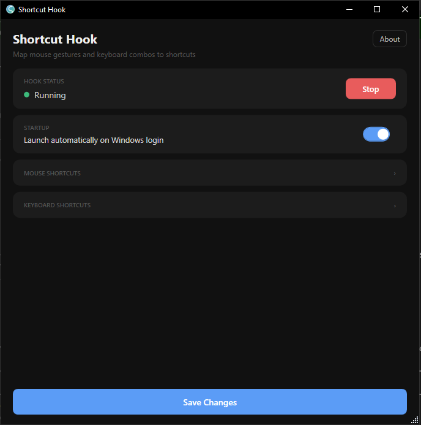
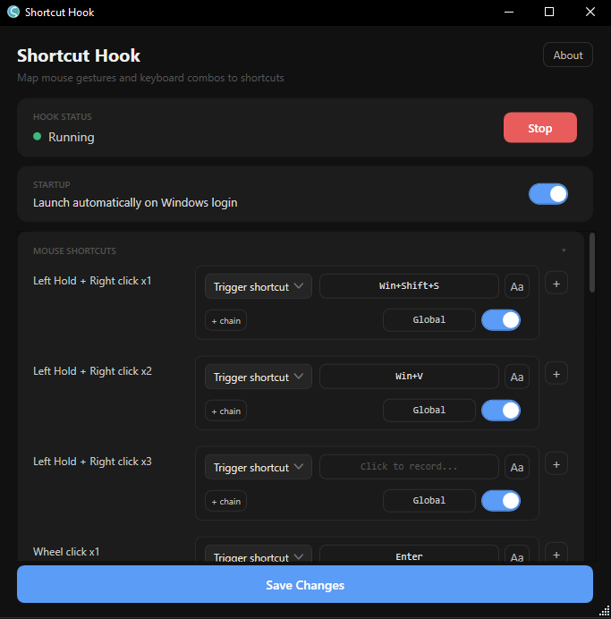
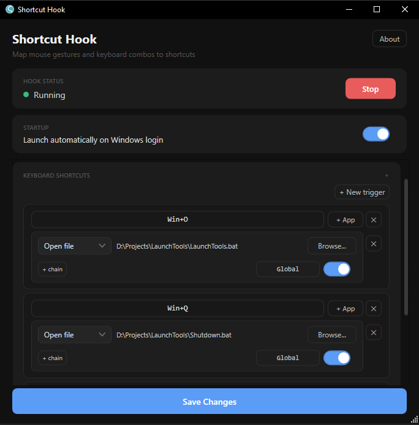

<p align="center">
  
</p>

<h1 align="center">ShortcutHook</h1>

A Windows tool that maps mouse gestures and keyboard combos to keyboard chords, shell-execute targets, or shell commands. Runs as a lightweight background daemon with a modern dark-mode WPF settings UI.

**[⬇️ Go to Download Section](#download)**

## Features

- **Mouse gestures** — Left+Right, Left+Right×2, Double/Triple Right-click, Right-hold+Scroll, Shift/Ctrl+Shift/Alt+Scroll, Double/Triple Wheel-click
- **Selection-aware double-right** — configure separate triggers for selected vs. unselected states. Works seamlessly for text, files, folders, and images in Explorer, web browsers, and other applications
- **Keyboard chords** — multi-key combos like `Ctrl+S+L` with smart defer logic for prefix pairs
- **Open anything** — launch apps, files, or folders via `open:` bindings
- **Run commands** — execute any shell command via `cmd:` (hidden) or `cmdw:` (visible window)
- **Per-application bindings** — scope any keyboard binding to a specific app (e.g. only fires when VS Code is the foreground window)
- **Per-binding enable/disable** — toggle individual bindings on/off without deleting them; disabled bindings are preserved in config and can be re-enabled any time
- **Hotkey conflict detection** — on save, keyboard combos are probed against Windows-registered hotkeys; an amber warning is shown if a combo is already claimed by another app
- **Modifier-scroll gestures** — Shift+Wheel, Ctrl+Shift+Wheel, and Alt+Wheel (up/down) as configurable triggers; Alt+Wheel defaults to horizontal scroll
- **Debounce toggle for scroll bindings** — opt-in per-binding cooldown (200 ms) to suppress rapid repeated scroll firings
- **Alt+Scroll → Horizontal Scroll** — optional toggle; holding Alt while scrolling fires a horizontal scroll event
- **First-run setup wizard** — choose where to install the app; daemon script always goes to `C:\Tools\ShortcutHook`
- **Startup on login** — optional toggle to launch the daemon automatically
- **Self-contained** — single `.exe`, no installer or runtime prerequisites

## Preview



<details>
<summary>Mouse gestures section</summary>



</details>

<details>
<summary>Keyboard bindings section</summary>



</details>

## Download

Grab the latest **ShortcutHookUI.exe** directly or browse all available versions:

- 🚀 [Download v1.5 EXE](https://github.com/veera-bharath/ShortcutHook/releases/download/v1.5/ShortcutHookUI.exe)
- 📦 [Browse Releases](https://github.com/veera-bharath/ShortcutHook/releases)

1. Run `ShortcutHookUI.exe`
2. The setup wizard appears on first launch — choose an app folder (default `C:\Tools\ShortcutHook`) and click **Finish Setup**
3. Configure your shortcuts and hit **Save Changes**

That's it. The daemon starts automatically whenever you save.

> [!NOTE]
> **SmartScreen / Antivirus warnings**: Since this app is unsigned, Windows SmartScreen may show "Windows protected your PC" on first launch — click **More info → Run anyway**. Your antivirus may also flag the background daemon, since it installs low-level keyboard/mouse hooks (a pattern shared with keyloggers, but used here only to detect your configured shortcuts). The source is fully open — review it or build from source yourself if you'd like to verify this before running.

## Install layout

| What | Where |
|------|-------|
| App (UI exe) | Your chosen folder (default `C:\Tools\ShortcutHook`) |
| Daemon script | Always `C:\Tools\ShortcutHook\ShortcutHook.ps1` |
| Config | `C:\Tools\ShortcutHook\shortcuts.json` |

## Config schema

```json
{
  "altHScroll": false,
  "bindings": [
    { "trigger": "mouse:left+right",        "outputs": ["Win+Shift+S"] },
    { "trigger": "mouse:left+rightx2",      "outputs": ["Ctrl+Z"] },
    { "trigger": "mouse:double-right",      "outputs": ["Ctrl+V"] },
    { "trigger": "mouse:double-right-sel",  "outputs": ["Ctrl+C"] },
    { "trigger": "mouse:right-scroll-down", "outputs": ["Delete"] },
    { "trigger": "mouse:alt-scroll-up",     "outputs": ["hscroll:left"] },
    { "trigger": "mouse:alt-scroll-down",   "outputs": ["hscroll:right"] },
    { "trigger": "mouse:shift-scroll-up",   "outputs": ["Left"],  "debounce": true },
    { "trigger": "mouse:double-wheel",      "outputs": ["open:C:\\path\\to\\app.lnk"] },
    { "trigger": "key:Ctrl+Alt+C",          "outputs": ["Ctrl+C"] },
    { "trigger": "key:Ctrl+S+L",            "outputs": ["F12"],   "apps": ["Code.exe"] },
    { "trigger": "key:Ctrl+Alt+T",          "outputs": ["open:C:\\path\\to\\app.lnk", "Win+Shift+S"], "outputDelay": 300 },
    { "trigger": "key:Ctrl+Alt+L",          "outputs": ["cmdw:tasklist"], "enabled": false }
  ]
}
```

**Trigger prefixes**
- `mouse:` — `left+right`, `left+rightx2`, `left+rightx3`, `double-right`, `double-right-sel`, `triple-right`, `single-wheel`, `double-wheel`, `triple-wheel`, `right-scroll-down`, `right-scroll-up`, `shift-scroll-down`, `shift-scroll-up`, `ctrl-shift-scroll-down`, `ctrl-shift-scroll-up`, `alt-scroll-down`, `alt-scroll-up`
- `key:` — any `Mod+Key` combo. Modifiers: `Ctrl`, `Shift`, `Alt`, `Win`
  > [!IMPORTANT]
  > To prevent hijacking standard operating system and application shortcuts, global single-letter `Ctrl` triggers (e.g. `Ctrl+A` through `Ctrl+Z`) are restricted and blocked. However, you can freely use:
  > - **Multi-key chords** (e.g., `Ctrl+K+C`, `Ctrl+S+L`)
  > - **Multi-modifier letter triggers** (e.g., `Ctrl+Shift+C`, `Ctrl+Alt+S`)
  > - **Non-letter Ctrl triggers** (e.g., `Ctrl+1`, `Ctrl+F5`, `Ctrl+Space`)

**Top-level fields**
- `altHScroll` — when `true`, holding Alt while scrolling fires a horizontal scroll instead of vertical (toggleable from the UI)

**Per-binding optional fields**
- `outputs` — array of one or more actions executed in order (chained). Use `outputDelay` to add a pause between steps.
- `outputDelay` — milliseconds to wait between chained `outputs` steps (e.g. `300`). Omit or set to `0` for no delay.
- `apps` — array of process names (e.g. `["Code.exe", "chrome.exe"]`) to scope the binding to specific foreground apps; omit or set to `null` for global. See [Per-application bindings](#per-application-bindings).
- `enabled` — set to `false` to disable a binding without deleting it; omit or set to `true` to keep it active. Disabled bindings are preserved in config and shown dimmed in the UI.
- `debounce` — set to `true` on scroll gesture bindings to ignore repeated firings within 200 ms. Useful when a single wheel tick registers multiple events. Omit or set to `false` (default) for normal behavior.

**Outputs**
- Keyboard chord — `Mod+Key` syntax (e.g. `Win+Shift+S`)
- Shell execute — `open:<path>` to launch an app, file, or folder
- Horizontal scroll — `hscroll:left` or `hscroll:right` (fires a `WM_MOUSEHWHEEL` event)
- Hidden command — `cmd:<command>` runs via `cmd.exe /c`, no window shown
- Visible command — `cmdw:<command>` opens a `cmd.exe` window and keeps it open after the command finishes

**Selection-aware double-right**

Configure both `mouse:double-right` (runs when nothing is selected, e.g. for Paste) and `mouse:double-right-sel` (runs when something is selected, e.g. for Copy). 

The daemon dynamically uses two advanced detection strategies depending on the active application:
- **File Explorer Native Query**: If the active foreground window is File Explorer or the Desktop, the daemon uses dynamic COM Automation Reflection to query `SelectedItems.Count` natively. If there is no selection, it executes Paste instantly with **zero clipboard clearing and zero simulated keystrokes**, completely avoiding any recursive system folder copy prompts (like `$RECYCLE.BIN`).
- **High-Fidelity Clipboard Backup & Restoration**: For all other applications, the daemon performs a simulated `Ctrl+C` check. It utilizes unmanaged Win32 APIs (`EnumClipboardFormats`, `GetClipboardData`, `GlobalAlloc`) to create a format-preserving binary-level backup of the clipboard (supporting text, copied files, HTML, rich text, and unmanaged GDI bitmap handles like `CF_BITMAP` and `CF_ENHMETAFILE` using `CopyImage`). If no selection is detected, the clipboard state is fully and losslessly restored, enabling copied images to be pasted into browser chats (like ChatGPT or Gemini) exactly like a physical `Ctrl+V` keypress.

## Per-application bindings

Any binding can be scoped to one or more applications by setting the `"apps"` array to the process names of the target applications (e.g. `"Code.exe"`, `"chrome.exe"`, `"WINWORD.EXE"`). The daemon checks the foreground window's process name before firing; if it doesn't match, the event passes through normally.

```json
{ "trigger": "key:Ctrl+S+L", "outputs": ["F12"], "apps": ["Code.exe"] }
```

Multiple apps can be listed in the array — the binding fires when any of them is the foreground window:

```json
{ "trigger": "mouse:double-right", "outputs": ["Alt+V"], "apps": ["WindowsTerminal.exe", "cmd.exe"] }
```

The app filter is configured via the scope button in each row of the settings UI. Selecting apps from the list populates the process names automatically; choosing "Global" clears it.

## Building from source

Requirements: Windows 10/11 · PowerShell 5.1+ · .NET 8 SDK

```
cd ShortcutHookUI
Publish.bat
```

Output: `build\ShortcutHookUI.exe`

## Repository structure

```
ShortcutHookScripts/   PowerShell daemon (ShortcutHook.ps1)
ShortcutHookUI/        .NET 8 WPF settings UI source
build/                 Local build output (not tracked by Git)
```

## License

MIT — © 2025 Veera Bharath
